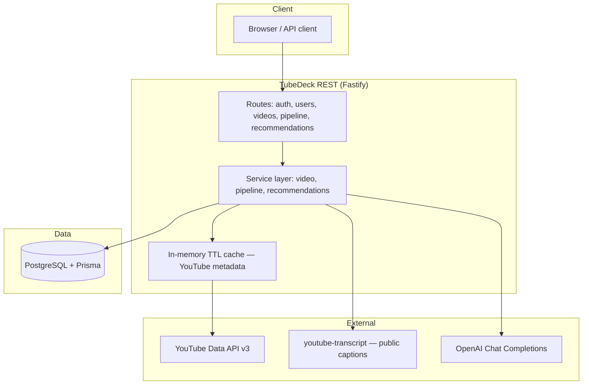

# Phase 2 — Third-party integrations (architecture)

Diagram for `backend-dev-api.md` Phase 2 deliverable.

**Failure handling:** transcript fetch retries + fallback text (title/description) for digest; OpenAI errors recorded in `videos.pipeline_last_error`. Metadata uses cache to reduce quota/latency.

**Recommendations:** only rows in `videos` owned by the user — queue head per deck (`pinned` → `favorite_rank` → `queue_order`), no global YouTube discovery.
